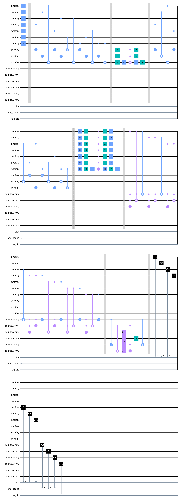

# Using Grover's algorithm to find out the distance and the codewords of a classical error correcting code

## Description

In classical error correction, we can find out the codewords of a code solving a system of modulo 2 equations and with the codewords we can calculate the distance of the code. This problem is a NP-hard problem and there are some studies where the authors try to propose algorithms that can solve this problem in an optimized way. Here we have a hybrid proposal (quantum and classical) where we use Grover's algorithm to find out the codewords and a classical post processing to determine the code distance.

## Example:

An example of code snippet that solves the modulo 2 equations of the parity check of the [7,4,3] code (Hamming code).

```python
import numpy as np
from grover_algorithm import GroverParityCheckSolver

matrix_H = np.array([[0,0,0,1,1,1,1],[0,1,1,0,0,1,1],[1,0,1,0,1,0,1]])

gpcs = GroverParityCheckSolver(parity_check_matrix = matrix_H)

code = gpcs.get_classical_error_correction_code()

print(code)
```

Quantum circuit to solve the modulo 2 equations of the parity check matrix of the [7,4,3] code (Hamming code).

